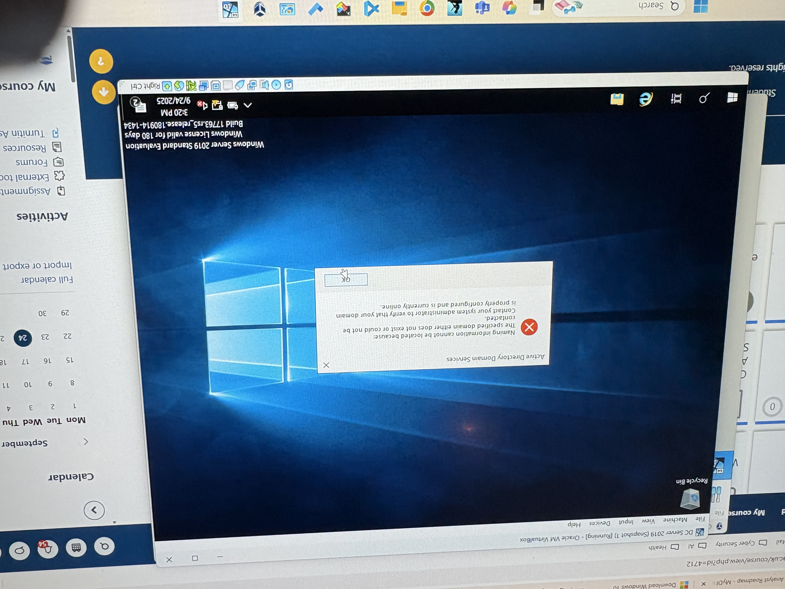

# Step 1 – Virtual Machine Setup

## Objective

Create and configure two virtual machines in VirtualBox to simulate a corporate domain environment:
- **Windows Server 2019** — acting as the Domain Controller
- **Windows 10 Client** — acting as a domain-joined endpoint

---

## Environment Overview

```
[ VirtualBox Host ]
       │
       ├── VM 1: Windows Server 2019 (Domain Controller)
       │         Role: AD DS, DNS, Group Policy Management
       │
       └── VM 2: Windows 10 Client (Endpoint)
                 Role: Domain-joined workstation
```

---

## VM Configuration

### Windows Server 2019 – Domain Controller

| Setting | Value |
|---------|-------|
| OS | Windows Server 2019 |
| RAM | 2–4 GB |
| Storage | 50 GB (dynamically allocated) |
| Network Adapter | Internal Network / Host-Only |
| Role | Active Directory Domain Services (AD DS) |
| Domain Name | `digitalsent.local` *(example)* |

**Steps taken:**
1. Created new VM in VirtualBox, attached Windows Server 2019 ISO
2. Completed OS installation with Desktop Experience
3. Set a static IP address for the server
4. Installed the **Active Directory Domain Services** role via Server Manager
5. Promoted server to Domain Controller, created new forest and domain
6. Verified AD DS and DNS were running correctly

---

### Windows 10 Client – Domain Endpoint

| Setting | Value |
|---------|-------|
| OS | Windows 10 |
| RAM | 2 GB |
| Storage | 30 GB (dynamically allocated) |
| Network Adapter | Same internal network as server |

**Steps taken:**
1. Created new VM in VirtualBox, attached Windows 10 ISO
2. Completed OS installation
3. Set DNS to point to the Server's static IP
4. Joined the machine to the domain via **System Properties → Computer Name → Change**
5. Restarted and verified domain login was available

---

## Network Configuration

Both VMs were placed on the same **Internal Network** adapter in VirtualBox to allow domain communication while isolating them from the host network.

- Server DNS: set to its own static IP (loopback for AD DS)
- Client DNS: set to the server's IP so it can resolve the domain

---

## Screenshots



*Windows Server 2019 Domain Controller running inside Oracle VM VirtualBox.*

---

## Notes

- Ensure both VMs are on the same internal network adapter name in VirtualBox
- The server must be fully promoted to DC before joining the client to the domain
- Disable Windows Firewall temporarily during initial setup if connectivity issues arise (re-enable after joining domain)

---

[← Back to README](README.md) | [Next: AD Users & Groups →](STEP2-AD-Users-Groups.md)
