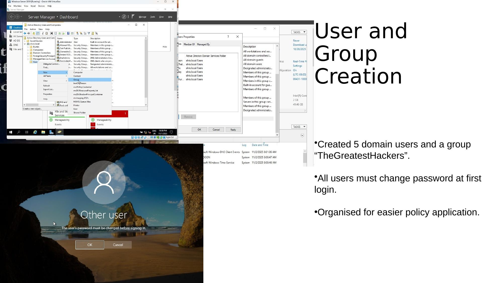

# Step 2 – Active Directory Users & Groups

## Objective

Configure Active Directory Domain Services (AD DS) with domain user accounts and security groups to support Group Policy targeting and access control.

---

## What Was Configured

### Domain Users

Created **5 domain user accounts** within Active Directory Users and Computers (ADUC).

| Setting | Value |
|---------|-------|
| Number of users | 5 |
| Password at first logon | Must change password |
| Account type | Standard domain users |

**Steps taken:**
1. Opened **Active Directory Users and Computers** on the Domain Controller
2. Navigated to the domain → right-clicked → `New → User`
3. Created 5 user accounts with unique usernames and temporary passwords
4. Enabled **"User must change password at next logon"** for all accounts

---

### Security Group

| Setting | Value |
|---------|-------|
| Group name | `TheGreatestHackers` |
| Group type | Security |
| Group scope | Global |

**Steps taken:**
1. In ADUC, right-clicked the Users OU → `New → Group`
2. Named the group `TheGreatestHackers`, set scope to **Global**, type to **Security**
3. Added domain users as members of the group

---

## Why This Matters

Organising users into **security groups** enables more efficient and targeted Group Policy deployment. Rather than applying policies per-user, GPOs can be filtered to specific groups — a fundamental best practice in enterprise environments.

This setup mirrors how a real SOC or IT security team would structure Active Directory before deploying policy controls.

---

## Key Concepts

| Concept | Description |
|---------|------------|
| AD DS | Centralised directory for managing users, computers, and policies |
| OU (Organisational Unit) | Container for grouping AD objects for policy targeting |
| Security Group | Used for access control and GPO scope filtering |
| "Change password at logon" | Forces users to set their own password — reduces admin knowledge of credentials |

---

## Screenshots

*Active Directory Users and Computers showing domain user accounts, the TheGreatestHackers security group, and the password change prompt on first login.*

---

[← VM Setup](STEP1-VM-Setup.md) | [Next: Password Policy →](STEP3-Password-Policy.md)
