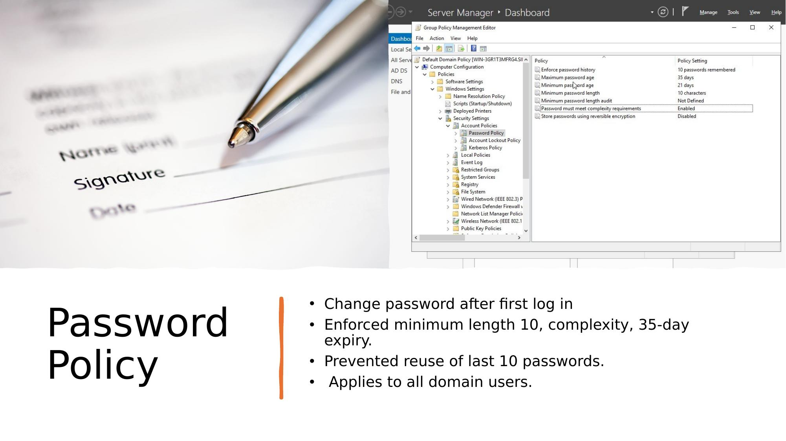

# Step 3 – Password Policy (GPO)

## Objective

Enforce a strong domain-wide password policy via Group Policy to reduce the risk of weak or compromised credentials — addressing one of Digital Sentinel's identified vulnerabilities.

---

## Policy Configuration

Applied via: **Default Domain Policy** (Group Policy Management Console)

| Setting | Value | Rationale |
|---------|-------|-----------|
| Minimum password length | 10 characters | Reduces brute-force success rate |
| Complexity requirements | Enabled | Requires uppercase, number, special character |
| Maximum password age | 35 days | Limits credential exposure window |
| Password history | 10 passwords remembered | Prevents reuse of old passwords |

---

## Implementation Steps

1. Opened **Group Policy Management Console (GPMC)** on the Domain Controller
2. Navigated to `Forest → Domains → [domain] → Default Domain Policy`
3. Right-clicked Default Domain Policy → **Edit**
4. Navigated to:
   ```
   Computer Configuration
   └── Policies
       └── Windows Settings
           └── Security Settings
               └── Account Policies
                   └── Password Policy
   ```
5. Configured each setting as per the table above
6. Ran `gpupdate /force` on the client to apply the policy immediately
7. Verified the policy was applied by attempting to set a weak password — correctly rejected

---

## Testing

| Test | Expected | Result |
|------|----------|--------|
| Password with fewer than 10 characters | Rejected | ✅ Pass |
| Password without complexity (e.g. `password`) | Rejected | ✅ Pass |
| Valid complex password accepted | Accepted | ✅ Pass |
| User prompted to change password on first login | Prompted | ✅ Pass |

---

## CIA Triad Mapping

| Principle | Application |
|-----------|------------|
| **Integrity** | Ensures only authorised users with strong credentials can authenticate |
| **Confidentiality** | Reduces risk of credential compromise through weak passwords |

---

## Key Concepts

| Term | Description |
|------|------------|
| GPO (Group Policy Object) | A set of rules applied to users/computers in a domain |
| Default Domain Policy | Built-in GPO applied to all domain users — used for account policies |
| Password complexity | Requires mix of uppercase, lowercase, numbers, and special characters |
| `gpupdate /force` | Command to immediately refresh Group Policy on a machine |

---

## Screenshots



*Group Policy Management Editor showing the configured password policy settings: 10-character minimum, complexity enabled, 35-day expiry, 10-password history.*

---

[← AD Users & Groups](STEP2-AD-Users-Groups.md) | [Next: GPO Controls →](STEP4-GPO-Controls.md)
