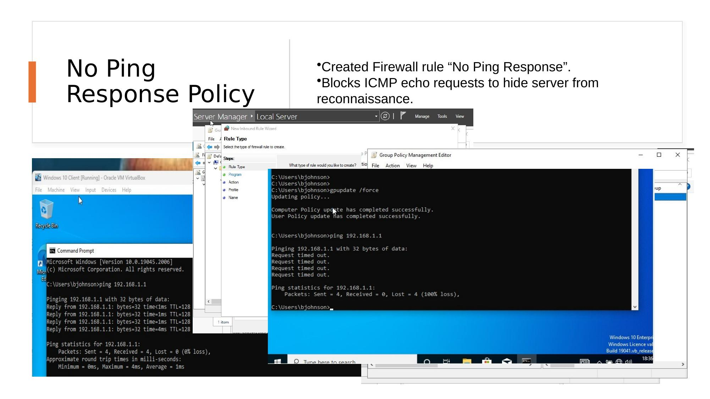
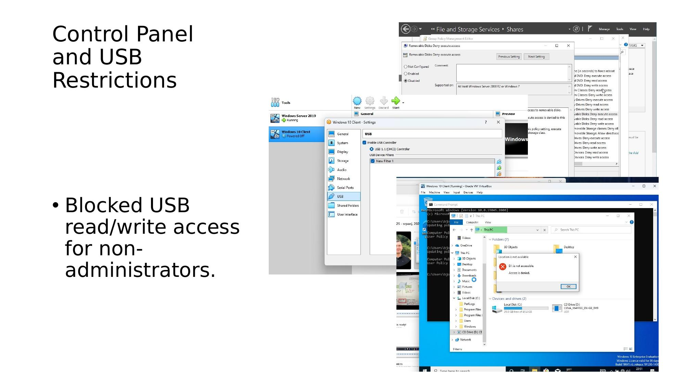
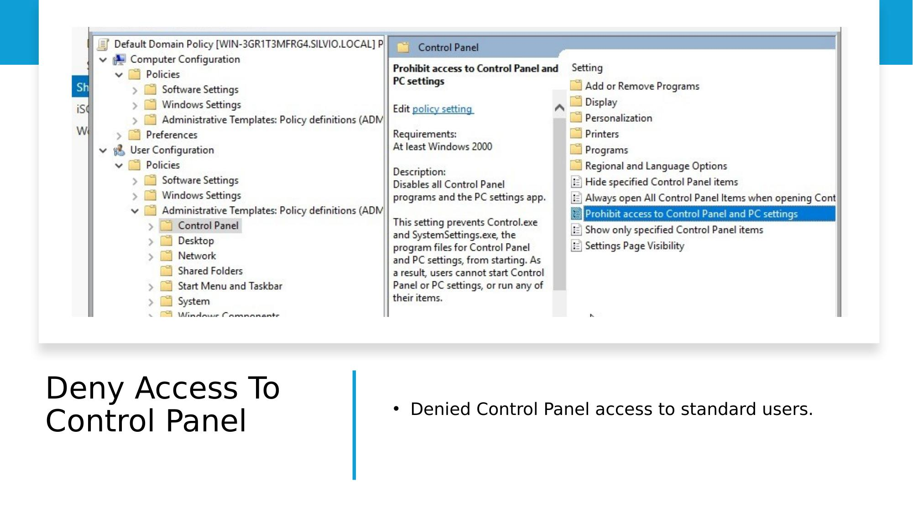
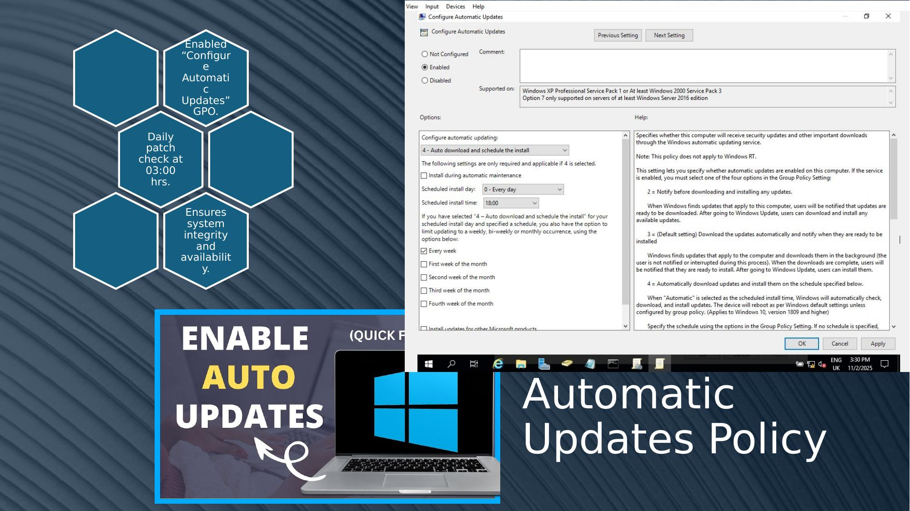

# Step 4 – GPO Controls (Ping Block, USB, Control Panel)

## Objective

Deploy three additional Group Policy controls to harden the Digital Sentinel domain environment against reconnaissance, data exfiltration, and unauthorised system access.

---

## Control 1 – No Ping Response (ICMP Block)

### Purpose
Prevent the server from responding to ICMP echo requests, hiding it from passive network reconnaissance tools (e.g. `ping`, `nmap` host discovery).

### Implementation

1. In GPMC, created a new GPO named **"No Ping Response"**
2. Navigated to:
   ```
   Computer Configuration
   └── Policies
       └── Windows Settings
           └── Security Settings
               └── Windows Firewall with Advanced Security
                   └── Inbound Rules
   ```
3. Created a new **Inbound Rule**:
   - Rule type: **Custom**
   - Protocol: **ICMPv4**
   - ICMP type: **Echo Request (Type 8)**
   - Action: **Block the connection**
   - Rule name: `No Ping Response`
4. Linked the GPO to the domain
5. Ran `gpupdate /force` and verified with a `ping` from the client — requests timed out ✅

### CIA Triad Mapping

| Principle | Application |
|-----------|------------|
| **Confidentiality** | Server no longer responds to reconnaissance pings — reduces attack surface exposure |

---

## Control 2 – USB Drive Restriction

### Purpose
Block standard domain users from reading or writing to USB storage devices, preventing data exfiltration and malware introduction via removable media.

### Implementation

1. Created or edited a GPO for endpoint controls
2. Navigated to:
   ```
   Computer Configuration
   └── Policies
       └── Administrative Templates
           └── System
               └── Removable Storage Access
   ```
3. Configured the following settings to **Enabled**:
   - `All Removable Storage classes: Deny all access`
   - *(Alternatively: Deny read/write access individually)*
4. **Administrators are exempt** — policy scoped to standard users only via GPO security filtering
5. Tested by inserting a USB on the client — access denied for standard users ✅

### CIA Triad Mapping

| Principle | Application |
|-----------|------------|
| **Confidentiality** | Prevents unauthorised data copying to removable media |
| **Integrity** (Deterrent) | Blocks introduction of malware or unauthorised software via USB |

---

## Control 3 – Control Panel Restriction

### Purpose
Prevent standard users from accessing Control Panel and PC Settings, reducing the risk of unauthorised system configuration changes.

### Implementation

1. In the same endpoint GPO:
2. Navigated to:
   ```
   User Configuration
   └── Policies
       └── Administrative Templates
           └── Control Panel
   ```
3. Set **"Prohibit access to Control Panel and PC Settings"** → **Enabled**
4. Administrators remain exempt (policy applied via user-level targeting)
5. Tested on the client — Control Panel was inaccessible for standard users ✅

### CIA Triad Mapping

| Principle | Application |
|-----------|------------|
| **Integrity** | Prevents users from modifying system settings, firewall, or network configuration |

---

## GPO Structure Summary

| GPO Name | Controls | Linked To |
|----------|---------|-----------|
| Default Domain Policy | Password Policy | Domain |
| No Ping Response | ICMP block firewall rule | Domain / OU |
| Endpoint Controls GPO | USB restriction, Control Panel block | Domain / OU |

---

## Screenshots

### No Ping Response


*Left: ping responding before policy (0% loss). Right: after GPO applied — 100% packet loss confirming the server is hidden from reconnaissance.*

### USB Restriction


*Removable Storage Access policy configured in GPMC, and the "Access is denied" error shown when a standard user attempts to open a USB drive.*

### Control Panel Restriction


*Group Policy Management Editor showing "Prohibit access to Control Panel and PC Settings" enabled under User Configuration.*

### Automatic Updates


*Configure Automatic Updates GPO set to auto-download and schedule install daily, ensuring patch compliance across the domain.*

---

[← Password Policy](STEP3-Password-Policy.md) | [Next: File Permissions & EFS →](STEP5-File-Permissions-EFS.md)
