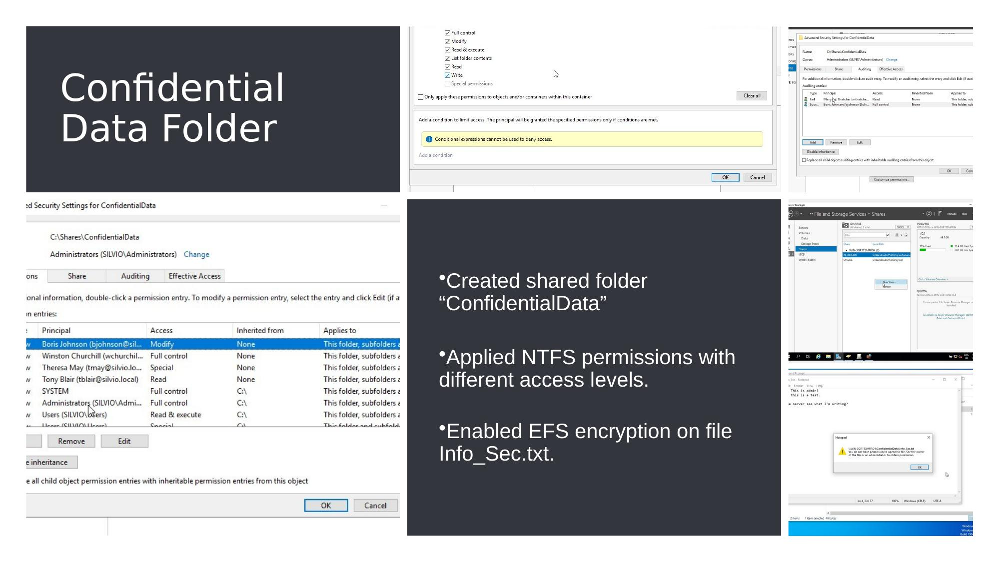

# Step 5 – File Permissions & EFS Encryption

## Objective

Secure sensitive company data on a shared network folder by applying granular NTFS permissions and encrypting a confidential file using the **Encrypting File System (EFS)** — ensuring only authorised users can access it.

---

## What Was Configured

### Shared Folder – `ConfidentialData`

A shared network folder named **`ConfidentialData`** was created on the Domain Controller/Server.

**Access control was applied using NTFS permissions**, with different levels of access assigned per user:

| User / Group | Permission Level |
|-------------|-----------------|
| Authorised users | Read / Read & Execute |
| Selected users | Full Control |
| Unauthorised users | No Access (explicitly denied or not assigned) |
| Administrators | Full Control |

---

## Implementation Steps

### 1. Create the Shared Folder

1. On the server, created a new folder: `C:\ConfidentialData`
2. Right-clicked the folder → **Properties → Sharing tab → Advanced Sharing**
3. Enabled sharing and set share name to `ConfidentialData`
4. Set share-level permissions to allow the relevant domain users

### 2. Configure NTFS Permissions

1. In folder **Properties → Security tab → Edit**
2. Added domain users with appropriate permission levels
3. Removed broad access groups (e.g. "Everyone") where appropriate
4. Verified that users without permission received an access denied message

### 3. Create and Encrypt the Confidential File

1. Inside `ConfidentialData`, created a text file: **`Info_Sec.txt`**
2. Right-clicked the file → **Properties → Advanced**
3. Ticked **"Encrypt contents to secure data"** → OK → Apply
4. EFS generated an encryption certificate tied to the authorised user account

---

## How EFS Works

EFS (Encrypting File System) is a Windows feature that encrypts files at rest using a **certificate-based key pair**:

- The file is encrypted with a **symmetric key (FEK – File Encryption Key)**
- The FEK is encrypted with the **user's public key** and stored with the file
- Only the user whose **private key** matches can decrypt the file
- Even an Administrator cannot read the file without the EFS certificate (unless a recovery agent is configured)

```
[ User A encrypts Info_Sec.txt ]
        │
        ▼
[ File encrypted with FEK ]
[ FEK encrypted with User A's public key ]
        │
        ▼
[ User B attempts to open file ]
[ No matching private key → ACCESS DENIED ]
```

---

## Testing

| Test | Expected | Result |
|------|----------|--------|
| Authorised user accesses shared folder | Success | ✅ Pass |
| Unauthorised user accesses shared folder | Denied + Logged | ✅ Pass |
| Authorised user opens `Info_Sec.txt` | Decrypted and readable | ✅ Pass |
| Unauthorised user opens `Info_Sec.txt` | Access denied | ✅ Pass |

---

## CIA Triad Mapping

| Principle | Application |
|-----------|------------|
| **Confidentiality** | EFS ensures only the certificate owner can read the file |
| **Integrity** | NTFS permissions prevent unauthorised modification |
| **Availability** | Authorised users maintain uninterrupted access |

---

## Key Concepts

| Term | Description |
|------|------------|
| NTFS Permissions | File system-level access control on Windows (Read, Write, Full Control, etc.) |
| EFS | Windows built-in encryption tied to user certificates — encrypts files at rest |
| FEK | File Encryption Key — symmetric key used to encrypt the actual file data |
| Share Permissions | Network-level access control (less granular than NTFS) |

---

## Screenshots



*Advanced Security Settings for ConfidentialData showing per-user NTFS permission levels. Bottom right: EFS-encrypted Info_Sec.txt — an unauthorised user receives an access denied error when attempting to open the file.*

---

[← GPO Controls](STEP4-GPO-Controls.md) | [Next: Testing →](STEP6-Testing.md)
