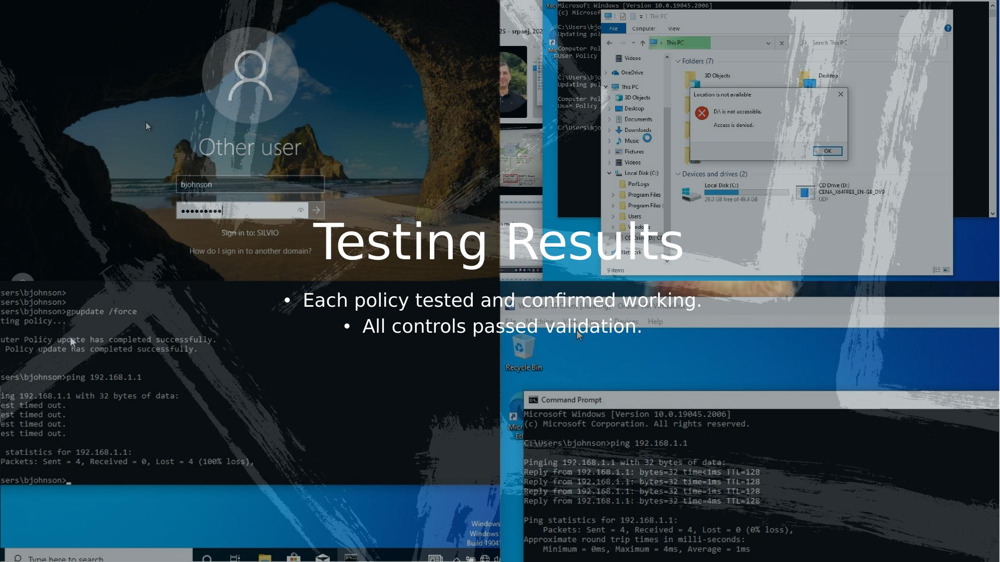

# Step 6 – Testing & Results

## Objective

Validate that all implemented security controls are functioning as expected. Each control was tested against its defined expected outcome on the domain-joined Windows 10 client.

---

## Test Environment

| Component | Details |
|-----------|---------|
| Domain Controller | Windows Server 2019 |
| Test Client | Windows 10 (domain-joined) |
| Test accounts | Standard domain users (non-admin) |
| Test method | Manual verification on the client VM |

---

## Full Test Results

| # | Test | Policy / Control | Expected Outcome | Result |
|---|------|-----------------|------------------|--------|
| 1 | Log on to domain | Active Directory | Successful domain logon | ✅ Pass |
| 2 | Password change prompt | Password Policy (GPO) | User prompted to change password on first login | ✅ Pass |
| 3 | Weak password rejected | Password Policy (GPO) | Password below complexity requirements rejected | ✅ Pass |
| 4 | Ping response blocked | No Ping Response (GPO) | Ping from client to server times out | ✅ Pass |
| 5 | Authorised folder access | NTFS Permissions | User with access can open `ConfidentialData` | ✅ Pass |
| 6 | Unauthorised folder access denied | NTFS Permissions | User without access denied + event logged | ✅ Pass |
| 7 | USB access blocked | Removable Storage GPO | USB read/write blocked for standard users | ✅ Pass |
| 8 | Control Panel restricted | Control Panel GPO | Control Panel inaccessible for standard users | ✅ Pass |
| 9 | Automatic updates enabled | Windows Update GPO | Update policy active, set to check daily at 03:00 | ✅ Pass |

**Result: 9/9 tests passed ✅**

---

## Test Detail: Ping Block

```
C:\> ping [SERVER-IP]

Pinging [SERVER-IP] with 32 bytes of data:
Request timed out.
Request timed out.
Request timed out.
Request timed out.

Ping statistics for [SERVER-IP]:
    Packets: Sent = 4, Received = 0, Lost = 4 (100% loss)
```

*Server ICMP echo requests successfully blocked by GPO firewall rule.*

---

## Test Detail: Weak Password Rejection

Attempted password: `password1` (no uppercase, no special character)

```
Windows could not update the password.
The value provided for the new password does not meet 
the length, complexity, or history requirements 
of the domain.
```

*Group Policy password complexity enforcement confirmed working.*

---

## Test Detail: USB Restriction

Standard user attempted to access a USB storage device:

```
You don't currently have permission to access this folder.
```
*(Or: Device access denied via Removable Storage policy)*

Administrator account was tested and retained USB access — confirming scope was correctly limited to standard users.

---

## Test Detail: Access Denied + Logging

Unauthorised domain user attempted to open `ConfidentialData` folder:

- Access denied message displayed
- Event ID **4656** (A handle to an object was requested) and **4663** (object access attempted) logged in **Windows Security Event Log**

This demonstrates the **Accountability** principle of Information Assurance — all access attempts are recorded.

---

## Lessons Learned

- GPO propagation requires either a reboot or `gpupdate /force` on the client — running this command before testing saved significant time
- NTFS permissions and share permissions must both be configured correctly — share permissions act as an outer gate, NTFS as the inner gate
- EFS encryption is user-certificate-bound, meaning the encrypting user account must be accessible during testing to verify decryption

---

## Screenshots



*Composite of live test results: domain login with password prompt, ping timeout (100% loss after ICMP block), and USB access denied error — all confirmed on the Windows 10 client.*

---

[← File Permissions & EFS](STEP5-File-Permissions-EFS.md) | [↑ Back to README](README.md)
